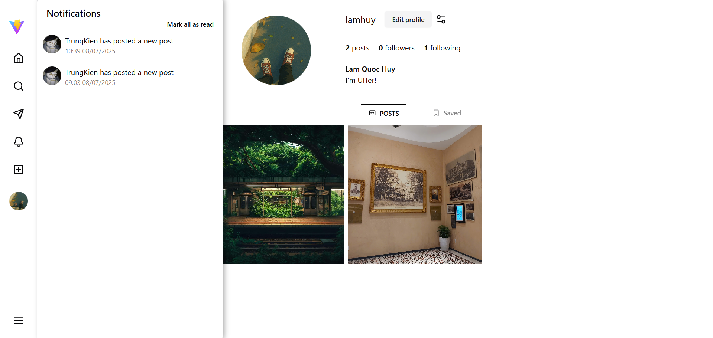
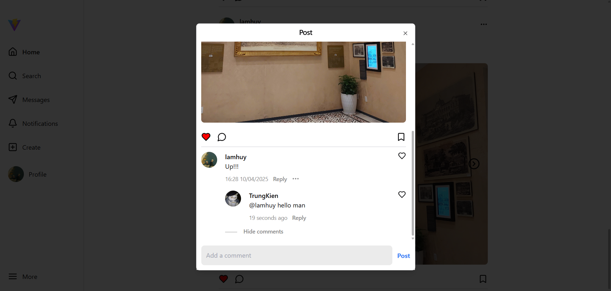

# 📚 Mini Social Media

Một ứng dụng mạng xã hội mini lấy cảm hứng giao diện từ Instagram cho phép người dùng đăng bài viết, tương tác với bài viết bằng like, comment, tìm kiếm người dùng, follow người dùng khác, và quản lý thông tin cá nhân, nhắn tin giữa các người dùng.

Sử dụng test account này để truy cập website:
- Email: lmquchuy2004@gmail.com
- Password: Huy@12345

## 🚀 Demo

- 🌐 Website: [Link website](https://social-media-three-orpin.vercel.app/)
- 📺 Video demo: [Link Youtube Demo](https://youtu.be/SJAbyXskhZE)

## 📸 Screenshot Demo

**Trang chủ:**


**Trang tin nhắn:**


**Trang cá nhân:**



**Dialog tạo bài viết:**


**Xem full bài viết:**



## ⚙️ Tính năng chính

- ✅ Đăng ký (với cơ chế xác thực email bằng otp)
- ✅ Đăng nhập với JWT (access và refresh token)
- ✅ Tạo / sửa / xoá bài viết
- ✅ Like, bình luận, thêm vào bài viết vào mục yêu thích
- ✅ Quản lý hồ sơ người dùng
- ✅ Nhắn tin có xác thực giữa các người dùng thông qua WebSocket/Socket.IO
- ✅ Follow người dùng
- ✅ Tìm kiếm người dùng
- ✅ Thông báo realtime
- ✅ Responsive UI

## 🛠️ Công nghệ sử dụng
**Frontend**:
- Vite
- ReactJS
- TailwindCSS
- Shadcn/ui
- Zustand
- Axios
- Cloudinary

**Backend**:
- NestJS (Node.js)
- PostgreSQL
- TypeORM
- JWT Authentication
- WebSocket (Socket.IO)

**Khác**:
- Render (Deploy Backend)
- Vercel (Deploy Frontend)
- Neon (Database Hosting)
- Postman (API Testing)

## 📦 Cài đặt local

```bash
# Clone project
git clone https://github.com/Sonous/Social-Media.git

# Cài đặt Frontend
cd frontend
npm install
npm run dev

# Cài đặt Backend
cd backend
npm install
npm run start:dev
```

## 🧩 Biến môi trường (Environment Variables)

### 📁 Backend (`/backend/.env`)

```env
#Mail service
EMAIL_HOST=
EMAIL_USER=
EMAIL_PASS=
EMAIL_PORT=

#Otp secret key
OTP_SECRET_KEY=

#Database
DATABASE_URL=

#Jwt secret key
JWT_SECRET_KEY=
COOKIE_SECRET=

#CORS URL
ORIGIN_CORS=

CLOUDINARY_API_SECRET=
```

### 📁 Frontend (`/frontend/.env`)
```env
VITE_BACKEND_URL=
VITE_BACKEND_URL=
VITE_CLOUDINARY_CLOUD_NAME=
VITE_CLOUDINARY_API_KEY=
```
